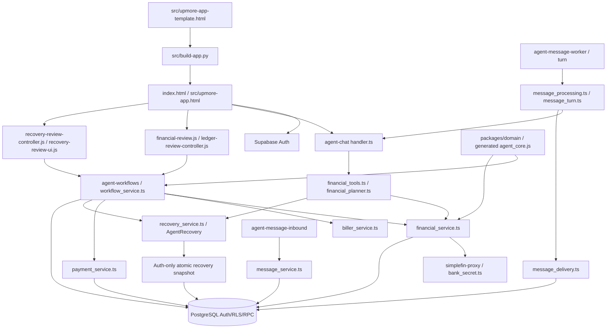

# Current components, October 10, 2026

Inspected branch `codex/upmore-production-integration-20261010`, HEAD `b63731c4fa239fb195d015984bd2fa4e9b8f116d`, plus substantial uncommitted work. See the evidence ledger for source digests. This is the actual integration checkout, not the older dirty checkout at `../upmore-agent`. Neither checkout has been replaced. No license file was found; license/provenance review remains open.

| Component | Existing responsibility | Actual limit |
| --- | --- | --- |
| Template/builder/static Vercel shell | Existing app views, Guide, transactions, legacy scenarios; generated inline CSP hashes | Some product catalogs are preparation/education. A route is not execution evidence. Actual browser QA pending. |
| Ledger review | Owner-scoped current bank facts, immutable user interpretations, reciprocal transfers, refunds and deterministic totals | Fake-DOM tests only; complete provider raw ingestion, split transactions, non-USD totals and report snapshots are unfinished. |
| Domain modules 33–40 | Monitors, intent, obligations, models, biller lifecycle, posted-flow and classified-ledger math | Numeric cents are safe-integer bounded; classified report totals use BigInt. Full multicurrency/currency-exponent support is missing. |
| Workflow service | Owner-bound saved/inferred bills, candidate confirmation, planning, reviewed approval and reserved execution RPC calls | Versioned bill preparation/edit interface is implemented locally; production payment/biller adapter registries are empty. Proposal lacks all delivery/rail terms required by parity prompt. |
| Financial tools | Eleven read/preparation tools using typed evidence and deterministic computations | Model cannot approve, classify or move money. Universal data coverage is not established. |
| Recovery read/preparation | Auth-only atomic retained-history snapshot, indexed candidate scanner, typed planner tool and app evidence/draft review | No verified refund allocation, durable recovery case, external sending, browser proof or live outcome. |
| Payment service | Durable before-submit marker, worker lease, original idempotency lookup, statuses and reconciliation | Synthetic adapters tested. No verified production rail or partner agreement. Settlement and creditor application remain distinct. |
| Messages services | Verified identity linking contracts, deduplicated inbox, leases, model quota, outbox and send markers | Transport registry empty. No proven live iMessage delivery or reminder run. |
| Bank read path | Existing SimpleFIN proxy, owner UUID secret namespace, retained normalized snapshots; separate legacy Plaid paths | No new production institution connection exercised. Read permission does not authorize writes. |
| Database migrations | Eighteen new unique-version migrations, Auth/RLS ownership, approval/revision checks, immutable reviews, leases/audits | Local throwaway PostgreSQL tested. Production migration history and release ordering remain unreconciled. |
| Testing/evidence | Deno edge, SQL/concurrency, synthetic agent100, legacy provider fixtures, fake-DOM rendering, parity validator | No configured root lint/format/security script discovered. No actual browser, sandbox-provider or new live verification. |

README, SPEC, BUILD_PLAN, LOOP and older app notes are historical product intentions. Current code and new owner instructions control this build. Old automatic-tier promotion and push/deploy instructions do not authorize recurring financial grants or a release. Existing HTML/JS/Supabase conventions are retained; no stack migration was introduced.

## Latest local additions

Chat owner/thread tickets and private-finance storage namespaces are integrated in the actual template. Legacy unowned data stays quarantined. Bills editing is revision-checked with immutable retry receipts (migration15). Applied-payment holds and fair reconciliation queues are enforced by migrations16/17. Recovery is now bundled and connected to Auth snapshot18, API, typed planning and UI; subscription-case remains unwired. Final recovery evidence supersedes the prior payment checkpoint for current source; all verification remains local/synthetic.
